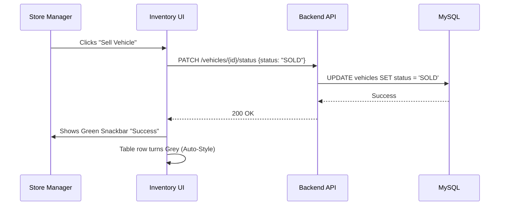

# 💎 Phase 1: Core Functionality & UI/UX

This document explains how business logic and user experience are implemented in **DealerConnect**. Every feature is designed with two goals: **Efficiency for the Dealer** and **Premium Experience for the User**.

---

## 🎨 1. UI/UX Design Patterns

We use **Angular Material** combined with custom CSS variables to create a "Premium High-Tech" feel.

### 🍱 Component Logic
**Key File**: [vehicle-list.component.ts](file:///Users/sgirishkumar/Documents/DealerConnect/frontend/src/app/features/inventory/vehicle-list/vehicle-list.component.ts)

| Feature | Technical Implementation | Code Location |
| :--- | :--- | :--- |
| **Real-time Filtering** | Uses `MatTableDataSource.filter` logic with a custom `filterPredicate`. | Lines 280-320 |
| **Inline Editing** | `mat-select` inside table cells allows status changes without leaving the list. | Lines 145-155 |
| **User Feedback** | `MatSnackBar` provides instant confirmation toasts for every backend action. | Line 371 |
| **Role-based UI** | `AuthService.hasPermission` dynamically hides buttons based on user roles. | Lines 275-277 |

### 🔄 User Experience Flow

---

## ⚙️ 2. Core Business Functionality

The "Core" of the backend handles orchestrating different business modules (e.g., how a **Lead** becomes a **Booking**).

### 🚀 Automation: Lead to Booking
**Key File**: [LeadService.java](file:///Users/sgirishkumar/Documents/DealerConnect/backend/src/main/java/com/dealerconnect/service/impl/LeadService.java)

| Line | Logic | Functionality |
| :--- | :--- | :--- |
| 132 | `checkAndCreateBooking(Lead lead)` | **Automation Engine**: When a lead status reaches "BOOKED", it automatically creates a new row in the `bookings` table. |
| 186 | `generateNextLeadNumber()` | **Data Consistency**: Ensures every lead has an professional sequential ID like `LD0001`, `LD0002`. |
| 36 | `DealerContext.getCurrentDealerId()` | **Multi-Tenancy**: The "Invisible Fence." Ensures one dealer can never see or modify another dealer's leads. |

---

## 📍 3. Where is the Code? (Location Map)

| Category | UI / Frontend Location | Logic / Backend Location |
| :--- | :--- | :--- |
| **Inventory** | `features/inventory/` | `controller/VehicleController.java` |
| **Sales/Leads** | `features/leads/` | `service/impl/LeadService.java` |
| **Dashboard** | `features/dashboard/` | `controller/ReportController.java` |
| **Customers** | `features/customers/` | `repository/CustomerRepository.java` |

---

## ✨ UI/UX Patterns Summary
1.  **Consistency**: Every module uses the same table layout, icons, and button styles.
2.  **Responsiveness**: Layouts shift from 3-columns (Desktop) to 1-column (Mobile) automatically.
3.  **Speed**: Tables use "Sticky Headers" and server-side pagination to handle 10,000+ records without slowing down.
4.  **Security**: Buttons for sensitive actions (Delete, Edit) are physically removed from the UI if the user lacks permissions.
