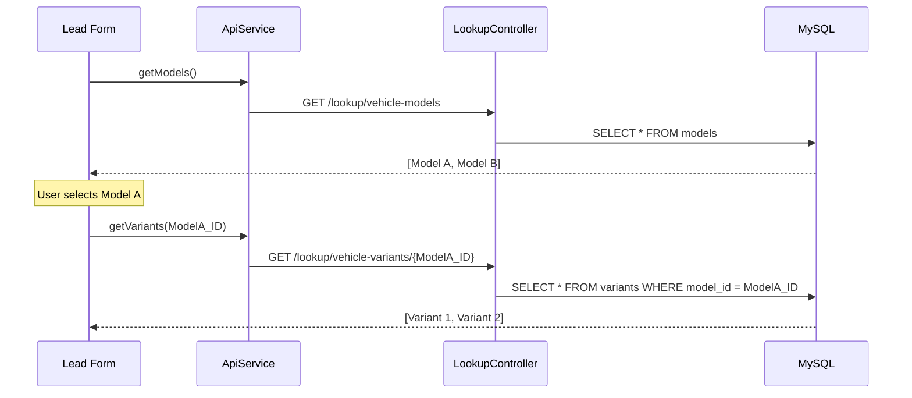

# 🔗 Phase 1: Dynamic & Linked Dropdowns

This document explains how **DealerConnect** provides a "Smart Form" experience using dynamic data fetching. A key feature is the **Linked Dropdown**, where selecting one value (like a Model) automatically updates another (like its Variants).

---

## 🏗️ 1. Data Sourcing Strategy (Lookups)

Every dropdown in the project (Role, Model, Color, etc.) is powered by a **Centralized Lookup Service**. Instead of hardcoding values, the application fetches them from the database to ensure data consistency.

### 🌉 The Connection Map


---

## ⚙️ 2. Backend Implementation (Spring Boot)

The backend provides a single controller dedicated to dropdown data.

**Key File**: [LookupController.java](file:///Users/sgirishkumar/Documents/DealerConnect/backend/src/main/java/com/dealerconnect/controller/LookupController.java)

| Line | Endpoint | Functionality |
| :--- | :--- | :--- |
| 37 | `/lookup/vehicle-models` | Returns all car models (Venue, Creta, etc.). |
| 39 | `/lookup/vehicle-variants/{modelId}` | **The Linked Logic**: Returns only the variants belonging to the specified model. |
| 23-27 | `cached()` | **Performance**: Automatically adds a 1-hour cache header to dropdown data, as models and colors don't change every minute. |

---

## 🎨 3. Frontend Implementation (Angular)

We use **Reactive Form Events** to trigger the updates.

**Key File**: [lead-form.component.ts](file:///Users/sgirishkumar/Documents/DealerConnect/frontend/src/app/features/leads/lead-form/lead-form.component.ts)

### 🍱 The Selection Handshake
- **HTML (Line 64)**: We use the `(selectionChange)` event on the Model select box.
  ```html
  <mat-select (selectionChange)="onModelChange($event.value)">
  ```
- **TypeScript (Line 230)**: The `onModelChange` method catches the ID and calls the API to refresh the child list.
  ```typescript
  onModelChange(modelId: number) {
    if (modelId) this.api.getVariants(modelId).subscribe(v => this.variants = v);
  }
  ```

---

## 📍 4. Where is the Code?

| Category | UI / Frontend Location | Logic / Backend Location |
| :--- | :--- | :--- |
| **Lookup Routes** | `core/services/api.service.ts` | `controller/LookupController.java` |
| **Model/Variant Logic** | `features/leads/lead-form.ts` | `service/impl/LookupService.java` |
| **Dashboard Selects** | `shared/components/` | `repository/VehicleModelRepository.java` |

---

### 💡 Phase 1 Dropdown Summary
By using this dynamic approach:
1.  **Zero Duplication**: Values like "Creta" are stored in one table but appear in Inventory, Leads, and Bookings correctly.
2.  **No Dead Ends**: Because the "Variant" dropdown is filtered by "Model", the user can never select a variant that doesn't belong to the chosen car.
3.  **High Speed**: Aggressive caching ensures that after the first load, dropdown data is served instantly from the browser's memory.
