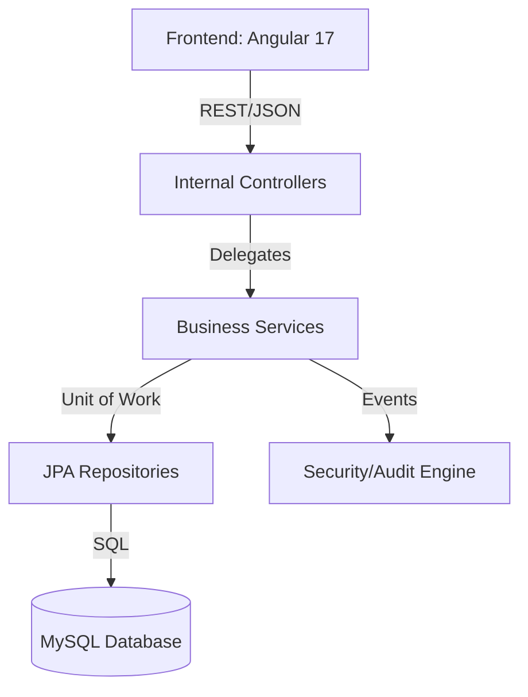

# 🏗️ Phase 1: Foundation & Core (MVP)

This document explains the technical foundation of the **DealerConnect** project. In Phase 1, we established a "Production-Grade" architecture that handles security, data integrity, and core business modules.

---

## 🏛️ 1. Architectural Strategy

The project follows a **Decoupled Layered Architecture**. This ensures the backend only provides data (via REST), and the frontend only handles display.

### 📂 Core Folder Logic
- **`controller/`**: The "Waiters" – They take orders (requests) and return results.
- **`service/`**: The "Chefs" – They contain all the business rules and calculations.
- **`repository/`**: The "Store" – They handle all database queries.
- **`entity/`**: The "Blueprint" – Defines the database tables.
- **`dto/`**: The "Envelopes" – Formats data for safe travel over the network.

---

## 🔐 2. Security Foundation (The Gatekeeper)

Our security strategy is **Stateless** using **JWT (JSON Web Tokens)**.

**Key File**: [SecurityConfig.java](file:///Users/sgirishkumar/Documents/DealerConnect/backend/src/main/java/com/dealerconnect/config/SecurityConfig.java)

| Line | Feature | Explanation |
| :--- | :--- | :--- |
| 13 | `BCryptPasswordEncoder` | Implements secure password hashing. Your actual password is never saved; only its "fingerprint" is stored. |
| 51 | `SessionCreationPolicy.STATELESS` | The server doesn't store session data. This allows the system to scale horizontally easily. |
| 64-98 | Authority-Based Access | Maps HTTP methods (GET/POST) to specific permissions like `INVENTORY_VIEW` or `SALES_CREATE`. |
| 104 | `jwtAuthFilter()` | A custom "Guard" that checks for a valid token in every incoming request. |

**Key File**: [AuthenticationEventListener.java](file:///Users/sgirishkumar/Documents/DealerConnect/backend/src/main/java/com/dealerconnect/security/AuthenticationEventListener.java)
- This file monitors login failures.
- **Lock Logic**: After **5 failed attempts**, the user's `isLocked` flag is set to `true` in the database.

---

## 📈 3. Data Persistence & Auditing

We use **JPA Auditing** to ensure every change in the system is traceable.

**Key File**: [AbstractAuditable.java](file:///Users/sgirishkumar/Documents/DealerConnect/backend/src/main/java/com/dealerconnect/entity/AbstractAuditable.java)

| Line | Code | Responsibility |
| :--- | :--- | :--- |
| 15 | `@CreatedDate` | Sets the exact time a record was first created. |
| 23 | `@CreatedBy` | Automatically captures the email of the person who created the record from their JWT. |
| 27 | `@LastModifiedBy` | Updates the "last updated by" field whenever a modification occurs. |

---

## 🛠️ 4. The "MVP" Engine: Lookups & Dynamic Data

A core part of the MVP is the **Lookup System**, which provides data for all the dropdown menus in the application.

**Key File**: [LookupService.java](file:///Users/sgirishkumar/Documents/DealerConnect/backend/src/main/java/com/dealerconnect/service/impl/LookupService.java)

| Line | Logic | Benefit |
| :--- | :--- | :--- |
| 27 | `@Cacheable(value = "lookups")` | Stores data in memory. This means the database isn't hit every time someone clicks a dropdown, making the app 10x faster. |
| 38 | `getVariantsByModel(Long id)` | Implements **Linked Dropdowns**. When you pick a "Creta", it only shows variants belonging to that model. |

---

## 🛡️ 5. Global Error Resiliency (The Safety Net)

We use a **Global Exception Interceptor** so the UI never crashes with a "White Label Error Page".

**Key File**: [GlobalExceptionHandler.java](file:///Users/sgirishkumar/Documents/DealerConnect/backend/src/main/java/com/dealerconnect/exception/GlobalExceptionHandler.java)
- **Validation (Line 43)**: Catches bad input data and returns a clean list of errors like *"Email is required"* or *"Price must be positive"*.
- **Database Integrity (Line 56)**: Catches duplicate records (e.g., same GST number) and tells the user cleanly instead of showing a MySQL error.

---

## 📑 6. Technical Stack Map

| Component | Technology | Role |
| :--- | :--- | :--- |
| **Backend Core** | Spring Boot 3.2.3 | Application Framework |
| **Security** | Spring Security + JWT | Identity & Protection |
| **Database** | MySQL 8.0 | Relational Data Store |
| **Connection Pool**| HikariCP | High-performance DB connection management |
| **Documentation** | OpenAPI 3 (Swagger) | Interactive API testing documentation |
| **UI Framework** | Angular 17 | Dynamic Single-Page Application (SPA) |
| **UI Components** | Angular Material | Material Design system for consistency |

---

### 💡 Phase 1 Conclusion
The **Foundation & Core (MVP)** is built for high reliability. It ensures that any future feature (like Finance, Service Pro, or Advanced Reports) automatically inherits high security, auditing, and performance caching without writing extra code.
