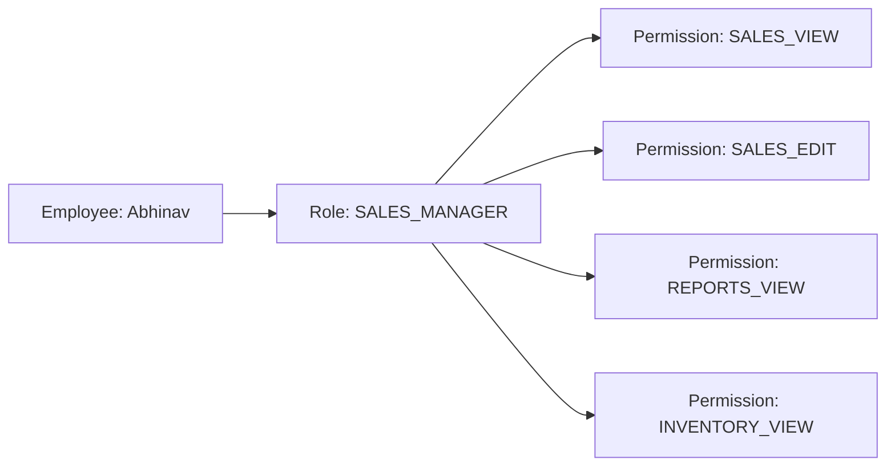

# 🔐 Phase 1: Role Management (Granular RBAC)

This document explains the **Role-Based Access Control (RBAC)** architecture of **DealerConnect**. We go beyond simple roles by using a "Role-to-Permission" mapping system, allowing for precise control over every action in the dealership.

---

## 🏛️ 1. Granular RBAC Architecture

In a professional dealership system, an "Admin" and a "Sales Executive" have very different needs. We use a two-tiered system to manage this:

1.  **Permissions (The "Can")**: Low-level actions like `INVENTORY_VIEW`, `SALES_CREATE`, or `SERVICE_EDIT`.
2.  **Roles (The "Who")**: A collection of permissions. For example, the `SALES_PERSON` role contains 10+ specific permissions.

### 🍱 The Connection Map

---

## ⚙️ 2. The Role-Permission Handshake

The system links these two entities using a many-to-many relationship, allowing one role to have many permissions, and one permission to be shared by many roles.

| Entity | Key Field | Responsibility |
| :--- | :--- | :--- |
| **Permission** | `name` | Unique string code (e.g., `INVENTORY_DELETE`) used in backend security checks. |
| **Role** | `name` | The high-level label (e.g., `ROLE_ADMIN`) used in the UI for user selection. |
| **Join Table** | `role_permissions` | The "Glue" that binds roles to specific allowed actions. |

---

## 🛠️ 3. System Seeding (Default Roles)

To ensure the dealership works "out-of-the-box," we seed the system with industry-standard roles during startup.

**Key File**: [DataInitializer.java](file:///Users/sgirishkumar/Documents/DealerConnect/backend/src/main/java/com/dealerconnect/config/DataInitializer.java)

| Role | Primary Permissions |
| :--- | :--- |
| **ADMIN** | Full access to Local Dealer (Employees, Inventory, Sales, Reports). |
| **SALES_EXECUTIVE**| Manage Leads, Customers, and Bookings. |
| **SERVICE_ADVISOR**| Manage Service Appointments and Vehicle History. |
| **SUPER_ADMIN** | Cross-dealer access, Dealer approvals, and Global Audit Logs. |

---

## 📍 4. Where is the Code?

| Category | File Path |
| :--- | :--- |
| **Data Models** | `entity/Role.java` & `entity/Permission.java` |
| **Security Mapping**| `security/UserDetailsServiceImpl.java` |
| **Role API** | `controller/RoleController.java` |
| **Initial Seeding** | `config/DataInitializer.java` |
| **Join Structure** | SQL Table: `role_permissions` |

---

### 💡 Phase 1 Role Management Summary
By implementing granular permissions:
1.  **Precision**: You can give a User the ability to *View* the inventory but block them from *Deleting* anything.
2.  **Scalability**: If the dealership grows and adds a "Finance Head" department, you can create a new Role and assign the exact permissions needed without modifying the backend code.
3.  **Security**: The backend checks for the `Permission` name (e.g., `INVENTORY_EDIT`) at the controller level, ensuring that even if the UI is compromised, the API remains secure.
