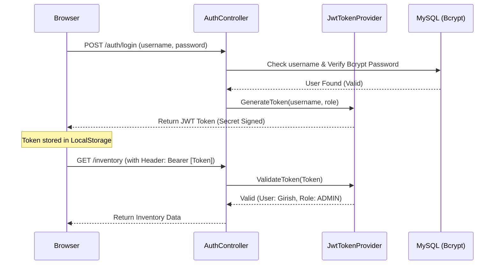

# 🔐 Phase 1: Security & Identity (Stateless JWT)

This document explains how **DealerConnect** protects user data and ensures that only authorized staff can access sensitive dealership information.

---

## 🏗️ 1. Security Philosophy: Stateless JWT

We do not store "Sessions" on the server. Instead, we use **JSON Web Tokens (JWT)**. This allows the system to be highly scalable and fast, as the server doesn't need to remember who is logged in—the token contains all the proof.

### 🍱 The Authentication Handshake

---

## 🛠️ 2. The Backend Fortress (Spring Security)

The backend uses **Spring Security 6** to create a multi-layered defense.

### 🍱 Key Components

| Component | File Path | Responsibility |
| :--- | :--- | :--- |
| **Main Config** | [SecurityConfig.java](file:///Users/sgirishkumar/Documents/DealerConnect/backend/src/main/java/com/dealerconnect/config/SecurityConfig.java) | Configures CORS, disables CSRF (standard for JWT APIs), and sets up the **Bouncer** (Filter Chain). |
| **The Token Maker** | [JwtTokenProvider.java](file:///Users/sgirishkumar/Documents/DealerConnect/backend/src/main/java/com/dealerconnect/security/JwtTokenProvider.java) | Handles the math of signing and parsing JWTs. It also extracts the user's role and dealer ID. |
| **The Bouncer** | [JwtAuthFilter.java](file:///Users/sgirishkumar/Documents/DealerConnect/backend/src/main/java/com/dealerconnect/security/JwtAuthFilter.java) | **Line 45**: Every request passes through this filter. It peels off the token, validates it, and tells the system "This person is allowed in." |
| **Safe Passwords** | `BCryptPasswordEncoder` | We never store raw passwords. We hash them using the industry-standard Bcrypt algorithm. |

---

## 🎨 3. Client-Side Authentication (Angular)

The frontend ensures the user stays logged in and automatically secures every request.

### 🍱 Automation Logic
**Key File**: [jwt.interceptor.ts](file:///Users/sgirishkumar/Documents/DealerConnect/frontend/src/app/core/interceptors/jwt.interceptor.ts)

- **Line 11-14**: The Interceptor "watches" every API call the app makes. If a token exists, it automatically attaches it as an `Authorization` header. This means developers don't have to manually add tokens to every service call.

---

## 👮 4. RBAC & Multi-Tenancy

Security in DealerConnect isn't just about logging in; it's about **Isolation**.

1.  **RBAC (Role Based Access Control)**: Using `@PreAuthorize("hasRole('ADMIN')")`, we ensure a Sales Executive can't access the Dealer Settings or see profit reports.
2.  **Dealer Isolation**: Using the **`DealerContext.java`**, we ensure that even if someone figures out their token, they can only see data belonging to their specific dealership.

---

## 📍 5. Where is the Code?

| Category | File Path |
| :--- | :--- |
| **Security Setup** | `backend/src/main/java/com/dealerconnect/config/SecurityConfig.java` |
| **JWT Generation** | `backend/src/main/java/com/dealerconnect/security/JwtTokenProvider.java` |
| **Login Logic** | `backend/src/main/java/com/dealerconnect/controller/AuthController.java` |
| **Auth Service** | `frontend/src/app/core/services/auth.service.ts` |
| **Token Interceptor** | `frontend/src/app/core/interceptors/jwt.interceptor.ts` |

---

### 💡 Phase 1 Security Summary
By implementing stateless JWT:
1.  **High Security**: Passwords are never stored in plain text, and tokens are signed with a private secret.
2.  **Smooth Experience**: The user stays logged in even if the tab is refreshed, thanks to persistent token storage.
3.  **Developer Friendly**: The interceptor pattern means developers can add new features without worrying about re-coding the security logic.
