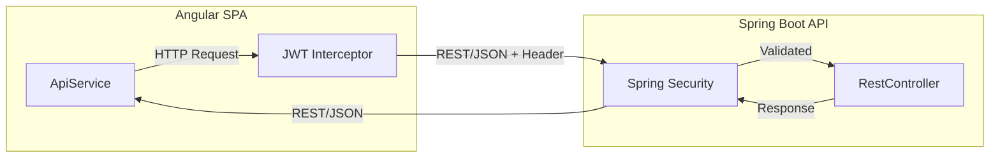

# 🚀 Phase 1: Spring Boot & Angular Setup

This document explains the technical handshake between our **Spring Boot 3** backend and **Angular 17** frontend. The system is designed to be completely decoupled, allowing each part to evolve independently.

---

## 🏗️ 1. Project Architecture

The project is split into two distinct directories:
```text
DealerConnect/
├── backend/    (Java Spring Boot 3 Engine)
└── frontend/   (Angular 17 UI / SPA)
```

### 🌉 How They Communicate
The frontend and backend talk to each other using **RESTful Web Services** and **JSON**.



---

## ⚙️ 2. Backend Strategy (Spring Boot 3)

The backend acts as a **Stateless API Provider**.

### 📦 Key Components
- **Framework**: Spring Boot 3.2.x using Java 17.
- **Dependency Management**: Maven (`pom.xml`).
- **Data Access**: Spring Data JPA with Hibernate.
- **REST Logic**: Controllers are annotated with `@RestController` and `@RequestMapping("/api/v1")`.

### 🔓 Integration: CORS (Cross-Origin Resource Sharing)
**Key File**: [SecurityConfig.java](file:///Users/sgirishkumar/Documents/DealerConnect/backend/src/main/java/com/dealerconnect/config/SecurityConfig.java)
- Since the Angular app (port 4200) and Spring app (port 8080) run on different ports, the backend must explicitly "allow" the frontend to connect.
- **Line 113**: `cfg.setAllowedOrigins(List.of("http://localhost:4200"))` is what bridges this gap.

---

## 🎨 3. Frontend Strategy (Angular 17)

The frontend is a **Single Page Application (SPA)** that handles all UI rendering and routing.

### 🍱 The Service Pattern
**Key File**: [api.service.ts](file:///Users/sgirishkumar/Documents/DealerConnect/frontend/src/app/core/services/api.service.ts)
- We use a **Centralized API Service**. No component ever calls the backend directly; they all go through this service.
- **Line 13**: `private base = environment.apiUrl;` - This allows us to change the backend address once for the whole app.

### 🛡️ The Security Interceptor
**Key Path**: `frontend/src/app/core/interceptors/jwt.interceptor.ts`
- This is a "silent worker" that automatically attaches your **JWT Token** to every request you send. You don't have to write code to add the token manually in every component.

---

## 📍 4. Integration Map (The Handshake)

| Feature | Backend Location | Frontend Location |
| :--- | :--- | :--- |
| **Protocol** | REST / JSON | Angular `HttpClient` |
| **API Port** | `8080` (Standard) | `4200` (Dev Port) |
| **Base URL** | `@RequestMapping("/api/v1")` | `environment.apiUrl` |
| **Identity** | `JwtTokenProvider.java` | `auth.service.ts` |
| **Data Types** | Java Entities / DTOs | TypeScript Interaces / Models |

---

### 💡 Phase 1 Setup Summary
By using this decoupled setup:
1.  **Independent Scaling**: We can host the Backend on a powerful server and the Frontend on a fast CDN (like Vercel or AWS S3).
2.  **Clean Code**: Java developers focus purely on business logic and SQL; Frontend developers focus purely on UI/UX and styling.
3.  **Modern Standards**: This is the industry-standard "Enterprise" way of building web applications.
