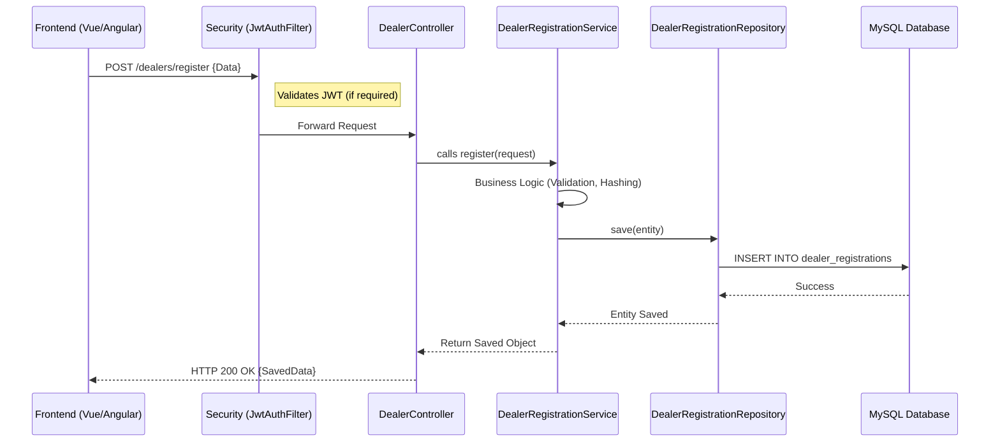

# Backend Code Flow & Study Guide

Welcome to the **DealerConnect** backend documentation. This guide explains how the backend is structured, how data flows through the system, and the best order to study the code to become productive quickly.

---

## 🏗️ 1. Architectural Overview

The backend is built using **Spring Boot** and follows a standard **Layered Architecture**. This separation of concerns ensures that the code is maintainable, testable, and scalable.

### 🏛️ The Layers

1.  **Controller Layer (`com.dealerconnect.controller`)**
    *   **Role**: The entry point for all API requests.
    *   **Responsibility**: Maps HTTP requests (GET, POST, etc.) to specific Java methods, handles URL parameters, and performs basic input validation.
    *   **Example**: [DealerController.java](file:///Users/sgirishkumar/Documents/DealerConnect/backend/src/main/java/com/dealerconnect/controller/DealerController.java)

2.  **Service Layer (`com.dealerconnect.service`)**
    *   **Role**: The "Brain" of the application.
    *   **Responsibility**: Contains all business logic (e.g., calculating taxes, checking stock, approving registrations). It orchestrates multiple repositories and manages transactions.
    *   **Example**: [DealerRegistrationService.java](file:///Users/sgirishkumar/Documents/DealerConnect/backend/src/main/java/com/dealerconnect/service/impl/DealerRegistrationService.java)

3.  **Repository Layer (`com.dealerconnect.repository`)**
    *   **Role**: Data Access Layer.
    *   **Responsibility**: Interfaces with the database using **Spring Data JPA**. It provides methods like `save()`, `findById()`, and custom queries.
    *   **Example**: [BookingRepository.java](file:///Users/sgirishkumar/Documents/DealerConnect/backend/src/main/java/com/dealerconnect/repository/BookingRepository.java)

4.  **Entity Layer (`com.dealerconnect.entity`)**
    *   **Role**: Database Models.
    *   **Responsibility**: Java classes that map directly to database tables (ORM). We use **Lombok** to minimize boilerplate code (getters/setters).
    *   **Example**: [Dealer.java](file:///Users/sgirishkumar/Documents/DealerConnect/backend/src/main/java/com/dealerconnect/entity/Dealer.java)

5.  **DTO Layer (`com.dealerconnect.dto`)**
    *   **Role**: Data Transfer Objects.
    *   **Responsibility**: Objects used to send/receive data between Frontend and Backend. They decouple the internal database structure from the external API contract.

---

## 🔄 2. The Journey of a Request

Here is how a single request (e.g., **Dealer Registration**) moves through the system:

---

## 🔐 3. Security & Authentication

Security is the "Gatekeeper" of the application. It sits in front of the controllers.

- **JWT (JSON Web Token)**: Used for stateless authentication.
- **JwtAuthFilter**: Intercepts every incoming request to check for a valid `Authorization: Bearer <token>` header.
- **UserDetailsServiceImpl**: Fetches user roles from the database to allow or deny access based on `@PreAuthorize` annotations in controllers.

---

## 📚 4. Recommended Study Order

If you are new to this codebase, follow this order to understand how everything connects:

1.  **Entities (`com.dealerconnect.entity`)**: Understand the data model first. What are the tables? How do they relate (OneToMany, ManyToOne)?
2.  **Repositories (`com.dealerconnect.repository`)**: See how we query data. Look for custom `@Query` methods.
3.  **Services (`com.dealerconnect.service.impl`)**: This is where the core logic resides. Pick one module (e.g., `VehicleService`) and trace its methods.
4.  **Controllers (`com.dealerconnect.controller`)**: See how the APIs are exposed to the frontend.
5.  **Security (`com.dealerconnect.security`)**: Understand how users log in and how their access is restricted.
6.  **Exception Handling (`com.dealerconnect.exception`)**: Look at `GlobalExceptionHandler` to see how we return consistent error messages to the frontend.

---

## 💡 Quick Tips
-   **Lombok**: If you don't see getters/setters, it's because of the `@Data` or `@Getter/@Setter` annotations.
-   **Validation**: Look for `@Valid` in controllers and `@NotBlank`, `@Size`, etc., in DTOs.
-   **Soft Delete**: Many entities use a `status` or `isActive` flag instead of being deleted permanently.
